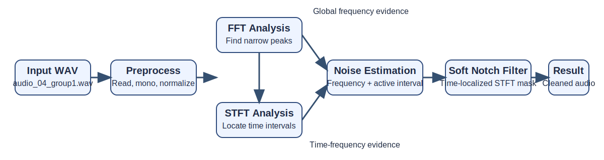
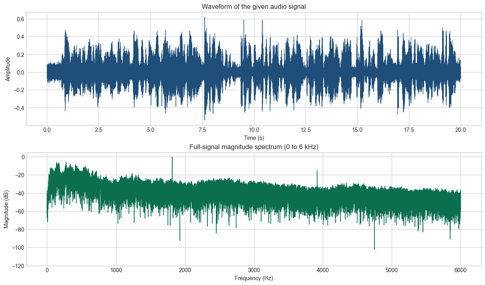
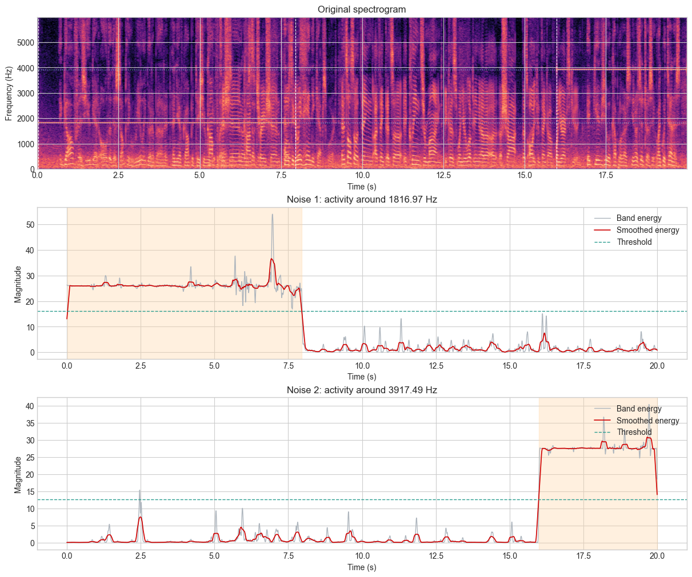
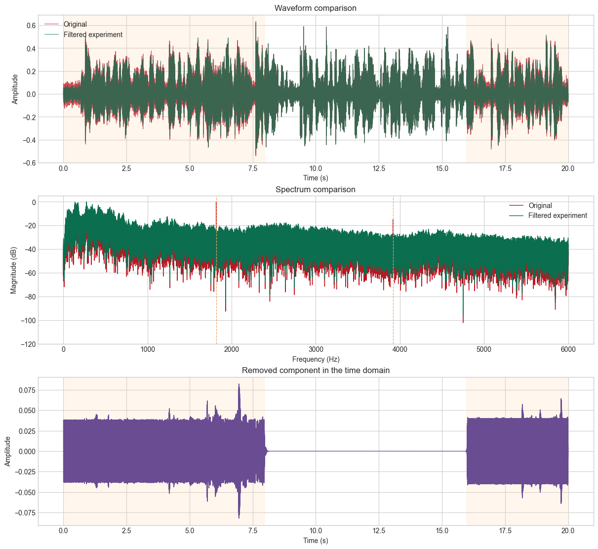
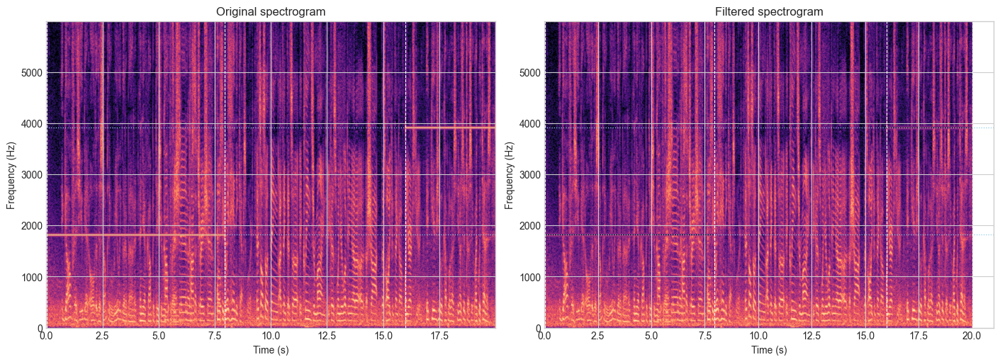

# Course Project Report

Course: 01204371 Transform Techniques in Signal Processing  
Title: Narrowband Interference Analysis and Reduction in `audio_04_group1.wav`

## 1. Objective

The objective of this project is to analyze the given audio signal, estimate the two unwanted interference frequencies, identify when each interference occurs, and reduce those interferences using transform-based methods taught in the course. The selected approach follows the syllabus topics directly: Fourier spectrum analysis for frequency identification, Short-Time Fourier Transform (STFT) and spectrogram analysis for time localization, and time-localized filtering in the STFT domain for interference suppression.

## 2. Designed System

The designed system works in four main stages:

1. Read the input WAV file and convert it into a normalized mono signal.
2. Analyze the full-signal spectrum with FFT to identify narrow spectral peaks that behave like interference.
3. Use STFT and spectrogram analysis to determine the active time interval of each interference.
4. Apply a soft notch filter only at the detected frequencies and only during the detected time intervals, then compare the signal before and after filtering.

### 2.1 Flow Chart

### 2.2 Processing Steps

1. **Input and preprocessing**  
   The audio file `audio/audio_04_group1.wav` is read and converted to floating-point format. If the audio has more than one channel, it is converted to mono to simplify the analysis.

2. **FFT-based frequency analysis**  
   A full-length Fourier Transform is computed to inspect the spectrum magnitude of the entire signal. This step reveals narrow peaks that are much sharper than the surrounding spectrum and are therefore likely to be interference components rather than desired audio content.

3. **STFT-based time localization**  
   Because the interference is not active during the whole recording, the system computes the STFT and displays the spectrogram. Then it tracks the energy around each candidate frequency over time. A threshold is applied to the smoothed band-energy curve in order to estimate the start and end time of each interference.

4. **Time-localized soft notch filtering**  
   After the frequency and time interval of each interference are known, a soft notch mask is applied in the STFT domain. The center frequency is attenuated most strongly, while nearby bins are attenuated more gradually. The filter is activated only during the detected time interval so that the rest of the recording is preserved as much as possible.

5. **Inverse STFT and evaluation**  
   The filtered STFT is transformed back to the time domain. Finally, the waveform, spectrum, and spectrogram before and after filtering are compared to evaluate the result.

### 2.3 Key Equations

Full-signal Fourier Transform:

$$
X(f) = \sum_n x[n] e^{-j 2 \pi f n / F_s}
$$

Short-Time Fourier Transform:

$$
X(m, k) = \sum_n x[n] w[n - mR] e^{-j 2 \pi k n / N}
$$

Time-localized filtering in the STFT domain:

$$
\hat{X}(m, k) = G(m, k) \cdot X(m, k)
$$

where \(G(m, k)\) is the soft notch mask applied only at the detected frequencies and active time intervals.

## 3. Experimental Setup

- Input file: `audio/audio_04_group1.wav`
- Sample rate: `44100 Hz`
- Duration: `20.00 s`
- Analysis method: `FFT + STFT + time-localized soft notch filter`
- Cleaned output prepared for grading: `audio/filtered_audio.wav`

## 4. Experimental Results

### 4.1 Basic Signal Inspection

The waveform and the full-signal spectrum are shown in Figure 1. The spectrum magnitude contains two clear narrow peaks, indicating the presence of tonal interference rather than broadband noise.

### 4.2 Interference Detection

The spectrogram and the energy curves used for interval detection are shown in Figure 2. The first interference is visible in the early part of the signal, while the second interference appears near the end of the signal.

Detected interference values:

| Noise | Frequency (Hz) | Active interval (s) |
| --- | ---: | --- |
| 1 | 1816.97 | 0.02 - 7.95 |
| 2 | 3917.49 | 15.99 - 20.00 |

### 4.3 Filtering Performance

The comparison between the original signal and the filtered signal is shown in Figure 3. The filtered result preserves most of the waveform shape while removing the unwanted narrowband components. The spectrum comparison also confirms that the two dominant interference peaks were strongly attenuated.

| Noise | Before amplitude | After amplitude | Reduction (dB) |
| --- | ---: | ---: | ---: |
| 1 | 0.038827 | 0.000582 | 36.49 |
| 2 | 0.040932 | 0.000544 | 37.54 |

### 4.4 Spectrogram Comparison

Figure 4 shows the spectrogram before and after filtering. The horizontal interference lines near `1816.97 Hz` and `3917.49 Hz` are significantly reduced after the soft notch filter is applied, while the remaining structure of the audio signal is still visible.

